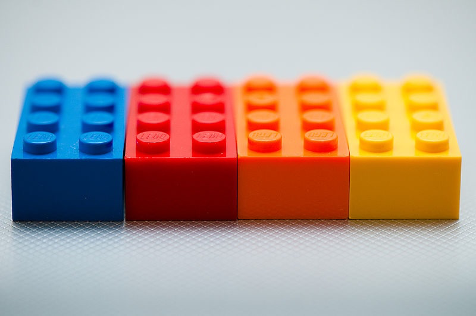

**This series of articles target beginners to react.**

## What is react and why it is so popular?

React is a javascript library created by Facebook to build modular and reusable user interfaces (UIs).
If you have been following web development recently, you can notice that everything is going modular and this includes not only javascript but also CSS.
Modularity in javascript is the key for writing maintainable, reusable and easy-to-debug web applications, it is a way of organizing things so the code will not get messy when applications scale.

React is a typical example of modularity. This library is based mainly on Components, which are javascript modules (files) that define how the UI looks like!
Think of react as a Lego game, every component is a block and you can join these blocks together to create bigger blocks and eventually you will build your final game!

> React.js is a javascript library for building user interfaces.
> A component in react resembles a piece or a part of the entire UI.

## Is it a library or a framework?

These definitions can get confusing. But Basically a framework is a set of libraries and tools that facilitate the development process and the library on its own can not be considered a framework.
however, in react world there are many frameworks that are based on react library. These frameworks are (without going into much details):

- create-react-app (the official one and the recommended for beginners)
- gatsby.js
- next.js

> create-react-app is the easiest way to get started as it comes loaded with tons of tools and features.

## What should you know before learning react?

You should be familiar with the basics of web development (ie, HTML5, CSS3 and javaScript). It is recommended that you learn the newer javascript syntax and features (ES6 and beyond) as react uses these features extensively. It is definitely possible to learn react without knowing ES6 features but it is more challenging.
In addition to ES6, familiarity with node.js and node package managers are also recommended.

> Knowing newer javaScript syntax and familiarity with node.js are recommended before learning react.

**The next article will be about setting the development environment and getting started with create-react-app.**
